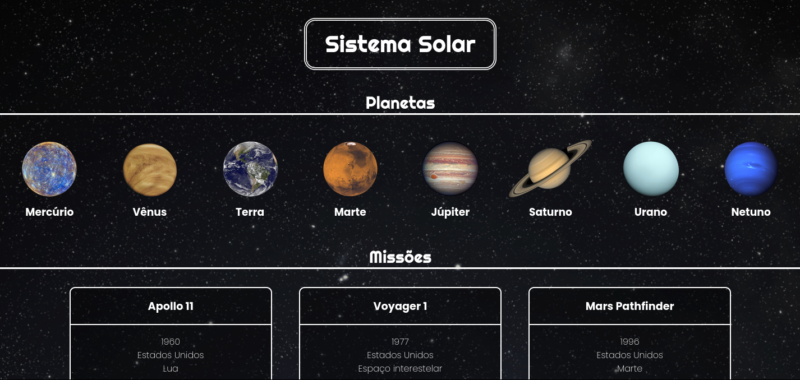

# Projeto Trybe - Solar System

Site estático em React para visualizar todos os planetas do sistema solar e todas as cartas com informações sobre missões espaciais.

#### Habilidades desenvolvidas:

- Utilizar JSX no React
- Utilizar corretamente o método render() para renderizar seus componentes
- Utilizar import para trazer componentes em diferentes arquivos
- Criar componentes de classe em React
- Criar múltiplos componentes a partir de um array
- Fazer uso de props corretamente
- Fazer uso de PropTypes para validar as props de um componente

#### Print da aplicação:

